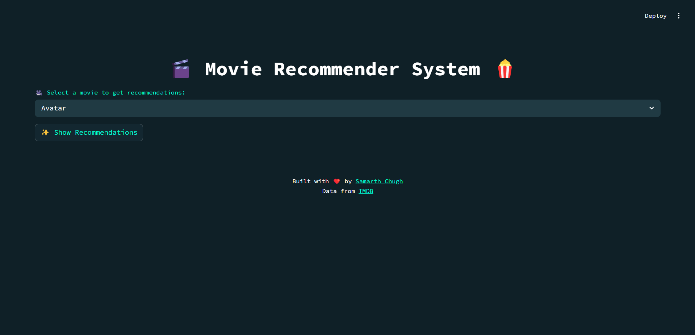
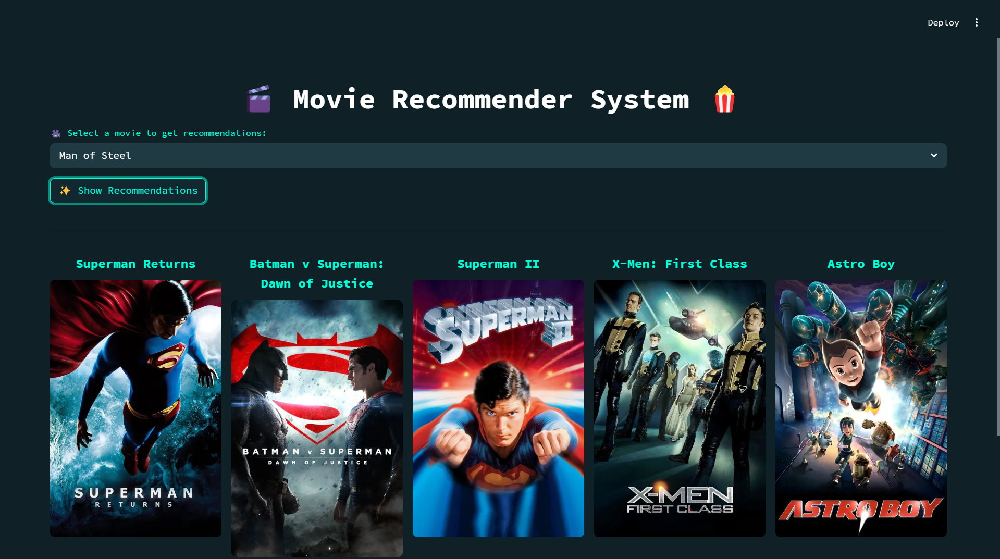

# 🎬 Movie Recommender System

An intelligent and visually appealing movie recommendation app built with **Streamlit** and powered by **TMDB API**. This tool suggests similar movies based on a selected title and displays their posters using real-time data.

---

## 🖼️ UI Design




---

## 📂 Project Structure

<pre lang="markdown"> ``` 
Movie-Recommendation-System/
├── .streamlit/
│   └── config.toml          # Theme customization for Streamlit
├── images/                  # UI screenshots and poster
├── model/                   # Pickled movie & similarity files
├── notebook/                # Jupyter notebook (EDA/model building)
├── RawData/                 # Raw data files (ignored in .gitignore)
├── venv/                    # Virtual environment (ignored)
├── app.py                   # Main Streamlit app
├── requirements.txt         # Python dependencies
├── .gitignore               # Git ignore rules
└── README.md    ``` </pre>

---

## 🚀 Features

- 🎥 Select a movie and get 5 similar movies instantly

- 🖼️ Each recommendation includes a movie poster

- 🤖 Uses cosine similarity on movie metadata

- 🌐 Fetches poster from [TMDB API](https://www.themoviedb.org/)

- ⚡ Clean UI built using customized Streamlit theme

---

## 🛠️ Tech Stack

- **Frontend**: Streamlit

- **Backend**: Python

- **ML**: Cosine Similarity

- **API**: TMDB (for movie posters)

- **Others**: Pandas, Scikit-learn, Pickle

---

## 🔧 Installation

<pre lang='markdown'>```
# 1. Clone the repository
git clone https://github.com/samarthchugh/Movie-Recommendation-System.git
cd Movie-Recommendation-System

# 2. Create a virtual environment (optional but recommended)
python -m venv venv
source venv/bin/activate  # or venv\Scripts\activate on Windows

# 3. Install dependencies
pip install -r requirements.txt

# 4. Run the app
streamlit run app.py

```</pre>

## ⚙️ TMDB API Setup

You must have an API key from [TMDB](https://developer.themoviedb.org/reference/intro/getting-started) to fetch posters.

The key is already included in the code for demo purposes.
You can replace it in fetch_poster() function inside app.py if needed:

<pre lang='markdown'>
api_key = 'your_api_key_here'
</pre>

## 🎨 Streamlit Theme (.streamlit/config.toml)
<pre lang='markdown'>
[theme]
primaryColor = "#F63366"
backgroundColor = "#1E1E1E"
secondaryBackgroundColor = "#31333F"
textColor = "#FAFAFA"
font = "sans serif"
</pre>

## 📦 Requirements
Dependencies listed in **requirements.txt**:
<pre lang='markdown'>
```
streamlit>=1.30.0
pandas
numpy
matplotlib
seaborn
scikit-learn
nltk
streamlit
ipykernel
```
</pre>

## 📄 License

MIT License — use, share, and contribute freely.

## 🙌 Acknowledgements
- [TMDB API](https://www.themoviedb.org/settings/api/request)
- [Streamlit](https://streamlit.io/)
- [Kaggle Movies Dataset](https://www.kaggle.com/datasets/tmdb/tmdb-movie-metadata)

## 📬 Contact
Made with ❤️ by [Samarth Chugh](https://www.linkedin.com/in/-samarthchugh/)
🔗 GitHub:[@samarthchugh](https://github.com/samarthchugh)